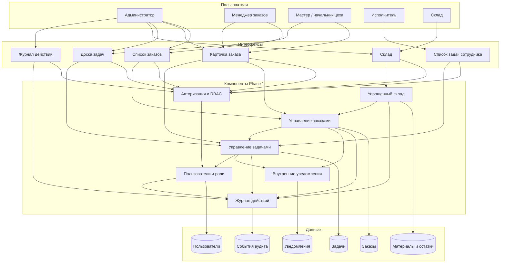

# CTfind Production Control - Phase 1

## 1. Назначение

Phase 1 покрывает базовую цифровизацию заказов и производственных задач.

## 2. Майлстоуны Phase 1

### Milestone 1. Основа системы

- авторизация
- bootstrap суперадмина
- пользователи
- роли
- права доступа
- справочник сотрудников

### Milestone 2. Контур заказов

- создание заказа
- редактирование заказа
- список заказов
- поиск и фильтрация
- статусы заказа:
  - новый
  - в работе
  - готов
  - отгружен
- карточка заказа

### Milestone 3. Контур производственных задач

- создание задач внутри заказа
- назначение исполнителя
- установка срока
- статусы задачи:
  - не начато
  - в работе
  - выполнено
- связь заказа и задач

### Milestone 4. Рабочие интерфейсы

- доска задач мастера
- список задач сотрудника
- отображение статусов
- базовая навигация между заказом и задачами

### Milestone 5. Контроль исполнения

- просрочки задач
- контроль сроков
- фильтры по статусам
- фильтры по исполнителям
- фильтры по срокам

### Milestone 6. Прозрачность изменений

- журнал действий
- история изменений заказа
- история изменений статусов
- фильтрация журнала

### Milestone 7. Внутренние уведомления

- новое назначение
- изменение статуса
- просрочка задачи

Канал: только внутри системы.

## 3. Пользовательские роли

### Администратор

- управление пользователями
- управление ролями
- доступ ко всем разделам
- просмотр журнала действий

### Менеджер заказов

- создание заказов
- редактирование заказов
- просмотр статусов
- контроль сроков заказа

### Мастер / начальник цеха

- создание задач по заказу
- назначение исполнителей
- просмотр доски задач
- контроль просрочек

### Исполнитель

- просмотр своих задач
- перевод задачи в работу
- перевод задачи в выполнено

### Склад

- просмотр материалов
- просмотр остатков
- списание под заказ

## 4. Основные экраны

- список заказов
- карточка заказа
- доска задач
- список задач сотрудника
- склад
- журнал действий
- пользователи (только ADMIN)

## 5. Ограничения Phase 1

В Phase 1 не входят:

- планирование смен
- планирование мощностей
- расчет загрузки ресурсов
- управление оборудованием
- MRP
- финансы
- бухгалтерия
- сложные интеграции
- AI-функции
- Telegram/email уведомления

## 6. Упрощения в рамках Phase 1

### Загрузка

Отображается только как:

- количество задач на исполнителе
- количество задач на этапе
- количество просроченных задач

### Склад

Учитываются только:

- материалы
- остатки
- списание под заказ

Без партий, резервирования и сложного складского учета.

## 7. Компонентная схема

## 8. Критерии завершения

Phase 1 завершена, если система позволяет:

- обеспечить первичный вход администратора (локально и production-like bootstrap)
- создать заказ
- изменить заказ
- перевести заказ в работу
- разбить заказ на задачи
- назначить исполнителей
- менять статусы задач
- видеть просрочки
- видеть текущий статус заказа
- видеть текущий статус задач
- просматривать журнал действий
- создавать пользователей и назначать им роли через кабинет администратора

